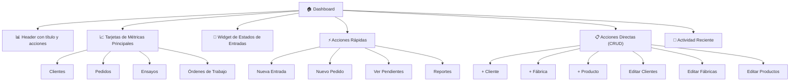

# Plan de Implementación: Nuevo Dashboard Principal

> ⚠️ **LEER ANTES DE IMPLEMENTAR**
> Este plan tiene un documento complementario de correcciones y mejoras:
> **`plans/2026-03-16-dashboard-redesign-fixes.md`**
>
> Contiene 2 bugs corregidos y 3 mejoras que afectan a las Fases 4, 5 y 6.
> No implementes esas fases copiando el código de abajo sin revisar ese documento primero.

## Objetivo

Reescribir el dashboard principal de DataLab para que sea más intuitivo, fácil de usar y visualmente consistente con el resto de la aplicación usando el "Liquid Glass Design System".

---

## Análisis del Estado Actual

### Problemas Identificados

| Problema | Descripción |
|----------|-------------|
| **Inconsistencia de estilos** | El dashboard usa clases de Bootstrap (`card`, `btn`, `row`, `col`) mientras otras páginas usan componentes glass |
| **Widgets anticuados** | `status_count_widget.html` y `quick_actions.html` no siguen el patrón visual glass |
| **Jerarquía confusa** | La información está dispersa sin una organización clara |
| **Falta de accesos directos** | No hay accesos rápidos para crear/editar entidades (clientes, fábricas, productos) |

### Estilos a Adoptar

El proyecto usa un **Liquid Glass Design System** con:

- **Glass Cards**: `glass-card`, `glass-md`, `glass-lg` con efectos de vidrio
- **Glass Buttons**: `btn-primary`, `btn-secondary`, `btn-ghost`, etc.
- **Variables CSS**: Colores semánticos (`primary-400`, `success-500`, `warning-500`, etc.)
- **Tipografía**: Plus Jakarta Sans + JetBrains Mono
- **Patrón de macros**: Componentes Jinja2 reutilizables

---

## Estructura Propuesta del Nuevo Dashboard



---

## Plan de Implementación

### Fase 1: Preparación del Template

**Objetivo**: Crear la estructura base del nuevo dashboard

1. **Archivo a modificar**: `app/templates/pages/dashboard/dashboard.html`

2. **Cambios necesarios**:
   - Cambiar `extends "base/base.html"` a `extends "base.html"`
   - Eliminar referencia a Bootstrap CSS (`<link href="https://cdn.jsdelivr.net/npm/bootstrap@5.3.2...">`)
   - Importar macros glass:
     ```jinja2
     
     
     
     ```

3. **Estructura del container principal**:
   ```jinja2
   <div class="max-w-7xl mx-auto">
       <!-- Header -->
       <h1 class="text-3xl font-bold text-gradient mb-8">
           <i class="fas fa-tachometer-alt mr-2 text-primary-400"></i>
           Dashboard
       </h1>
       ...
   </div>
   ```

---

### Fase 2: Widget de Métricas Principales

**Objetivo**: Mostrar las 4 métricas principales con estilo glass

**Layout actual** (Bootstrap):
```html
<div class="row g-3">
    <div class="col-md-6">
        {{ metric_card(...) }}
    </div>
</div>
```

**Layout nuevo** (Glass/Tailwind):
```html
<div class="grid grid-cols-1 md:grid-cols-2 lg:grid-cols-4 gap-4 mb-8">
    <!-- Tarjeta 1: Clientes -->
    <a href="#" class="block group">
        
            <h5 class="text-sm font-medium text-primary-400 mb-2">Total Clientes</h5>
            <h2 class="text-3xl font-bold text-text-primary font-mono">{{ stats.total_clientes }}</h2>
        
    </a>
    
    <!-- Tarjeta 2: Pedidos -->
    <a href="#" class="block group">
        
            <h5 class="text-sm font-medium text-success-500 mb-2">Total Pedidos</h5>
            <h2 class="text-3xl font-bold text-text-primary font-mono">{{ total_pedidos }}</h2>
        
    </a>
    
    <!-- Tarjeta 3: Ensayos -->
    <a href="#" class="block group">
        
            <h5 class="text-sm font-medium text-warning-500 mb-2">Total Ensayos</h5>
            <h2 class="text-3xl font-bold text-text-primary font-mono">{{ total_ensayos }}</h2>
        
    </a>
    
    <!-- Tarjeta 4: Órdenes de Trabajo -->
    <a href="#" class="block group">
        
            <h5 class="text-sm font-medium text-info-500 mb-2">Órdenes de Trabajo</h5>
            <h2 class="text-3xl font-bold text-text-primary font-mono">{{ total_ordenes }}</h2>
        
    </a>
</div>
```

---

### Fase 3: Widget de Estados de Entradas

**Objetivo**: Mostrar el conteo por estado con estilo glass

**Componente a crear**: `app/templates/components/dashboard/status_count_glass.html`

```html

<div class="grid grid-cols-2 md:grid-cols-5 gap-4 mb-8">
    <!-- Recibido -->
    <div class="p-4 rounded-xl bg-glass-1 border border-glass-border hover:border-gray-500/30 transition-all cursor-pointer">
        <div class="flex items-center gap-3 mb-2">
            <div class="w-10 h-10 rounded-lg bg-gray-500/20 flex items-center justify-center">
                <i class="fas fa-inbox text-gray-400"></i>
            </div>
            <span class="text-xs text-text-muted uppercase">Recibido</span>
        </div>
        <div class="text-2xl font-bold text-text-primary font-mono">{{ status_counts.RECIBIDO|default(0) }}</div>
    </div>
    
    <!-- En Proceso -->
    <div class="p-4 rounded-xl bg-primary-50/20 border border-primary-500/30 hover:border-primary-400/50 transition-all cursor-pointer">
        <div class="flex items-center gap-3 mb-2">
            <div class="w-10 h-10 rounded-lg bg-primary-500/20 flex items-center justify-center">
                <i class="fas fa-spinner text-primary-400"></i>
            </div>
            <span class="text-xs text-text-muted uppercase">En Proceso</span>
        </div>
        <div class="text-2xl font-bold text-text-primary font-mono">{{ status_counts.EN_PROCESO|default(0) }}</div>
    </div>
    
    <!-- Completado -->
    <div class="p-4 rounded-xl bg-success-50/20 border border-success-500/30 hover:border-success-400/50 transition-all cursor-pointer">
        <div class="flex items-center gap-3 mb-2">
            <div class="w-10 h-10 rounded-lg bg-success-500/20 flex items-center justify-center">
                <i class="fas fa-check-circle text-success-400"></i>
            </div>
            <span class="text-xs text-text-muted uppercase">Completado</span>
        </div>
        <div class="text-2xl font-bold text-text-primary font-mono">{{ status_counts.COMPLETADO|default(0) }}</div>
    </div>
    
    <!-- Entregado -->
    <div class="p-4 rounded-xl bg-info-50/20 border border-info-500/30 hover:border-info-400/50 transition-all cursor-pointer">
        <div class="flex items-center gap-3 mb-2">
            <div class="w-10 h-10 rounded-lg bg-info-500/20 flex items-center justify-center">
                <i class="fas fa-truck text-info-400"></i>
            </div>
            <span class="text-xs text-text-muted uppercase">Entregado</span>
        </div>
        <div class="text-2xl font-bold text-text-primary font-mono">{{ status_counts.ENTREGADO|default(0) }}</div>
    </div>
    
    <!-- Anulado -->
    <div class="p-4 rounded-xl bg-error-50/20 border border-error-500/30 hover:border-error-400/50 transition-all cursor-pointer">
        <div class="flex items-center gap-3 mb-2">
            <div class="w-10 h-10 rounded-lg bg-error-500/20 flex items-center justify-center">
                <i class="fas fa-times-circle text-error-400"></i>
            </div>
            <span class="text-xs text-text-muted uppercase">Anulado</span>
        </div>
        <div class="text-2xl font-bold text-text-primary font-mono">{{ status_counts.ANULADO|default(0) }}</div>
    </div>
</div>

```

---

### Fase 4: Acciones Rápidas + Acciones Directas (CRUD)

**Objetivo**: Crear una sección consolidada de accesos directos

> 🔴 **Bug 1 — imports obligatorios en este archivo**
> El macro usa `glass_card` internamente pero Jinja2 ejecuta los macros
> en el scope de su propio archivo de origen. Sin los imports, el componente
> falla al renderizar con `UndefinedError`.
> Ver **Bug 1** en `plans/2026-03-16-dashboard-redesign-fixes.md`.
>
> 🔴 **Bug 2 — guard de permisos en "Nueva Fábrica"**
> `fabricas.nueva` requiere rol `laboratory_manager` o `admin`.
> Sin el ``, usuarios sin permiso ven un 403 al clickear.
> Ver **Bug 2** en `plans/2026-03-16-dashboard-redesign-fixes.md`.
>
> ✅ **Mejora B — botón "En proceso" con filtro**
> El plan original del `quick_actions.html` tenía este acceso directo.
> Recuperarlo en la sección "Ver Listados" del nuevo panel.
> Ver **Mejora B** en `plans/2026-03-16-dashboard-redesign-fixes.md`.

**Nuevo componente**: `app/templates/components/dashboard/actions_panel.html`

```html



<h3 class="text-lg font-semibold text-text-primary">
    <i class="fas fa-bolt mr-2 text-warning-500"></i>
    Acciones Rápidas
</h3>



<!-- Primera fila: Crear nuevos registros -->
<div class="mb-6">
    <h4 class="text-sm font-medium text-text-secondary mb-3 uppercase tracking-wide">
        <i class="fas fa-plus-circle mr-1"></i> Nuevo Registro
    </h4>
    <div class="grid grid-cols-2 md:grid-cols-4 gap-3">
        <a href="{{ url_for('entradas.nueva') }}" class="p-3 rounded-lg bg-primary-50/20 border border-primary-500/30 hover:bg-primary-50/30 transition-all text-center">
            <i class="fas fa-vial text-primary-400 mb-1"></i>
            <span class="text-sm text-text-primary block">Nueva Entrada</span>
        </a>
        <a href="{{ url_for('pedidos.nuevo') }}" class="p-3 rounded-lg bg-success-50/20 border border-success-500/30 hover:bg-success-50/30 transition-all text-center">
            <i class="fas fa-clipboard-list text-success-400 mb-1"></i>
            <span class="text-sm text-text-primary block">Nuevo Pedido</span>
        </a>
        <a href="{{ url_for('clientes.nuevo') }}" class="p-3 rounded-lg bg-secondary-50/20 border border-secondary-500/30 hover:bg-secondary-50/30 transition-all text-center">
            <i class="fas fa-user-plus text-secondary-400 mb-1"></i>
            <span class="text-sm text-text-primary block">Nuevo Cliente</span>
        </a>
        <a href="{{ url_for('fabricas.nueva') }}" class="p-3 rounded-lg bg-warning-50/20 border border-warning-500/30 hover:bg-warning-50/30 transition-all text-center">
            <i class="fas fa-industry text-warning-500 mb-1"></i>
            <span class="text-sm text-text-primary block">Nueva Fábrica</span>
        </a>
    </div>
</div>

<!-- Segunda fila: Gestionar registros -->
<div class="mb-6">
    <h4 class="text-sm font-medium text-text-secondary mb-3 uppercase tracking-wide">
        <i class="fas fa-cogs mr-1"></i> Gestionar
    </h4>
    <div class="grid grid-cols-2 md:grid-cols-4 gap-3">
        <a href="{{ url_for('clientes.listar') }}" class="p-3 rounded-lg bg-glass-1 border border-glass-border hover:bg-glass-2 transition-all text-center">
            <i class="fas fa-users text-text-secondary mb-1"></i>
            <span class="text-sm text-text-secondary block">Clientes</span>
        </a>
        <a href="{{ url_for('fabricas.listar') }}" class="p-3 rounded-lg bg-glass-1 border border-glass-border hover:bg-glass-2 transition-all text-center">
            <i class="fas fa-building text-text-secondary mb-1"></i>
            <span class="text-sm text-text-secondary block">Fábricas</span>
        </a>
        <a href="{{ url_for('productos.listar') }}" class="p-3 rounded-lg bg-glass-1 border border-glass-border hover:bg-glass-2 transition-all text-center">
            <i class="fas fa-box text-text-secondary mb-1"></i>
            <span class="text-sm text-text-secondary block">Productos</span>
        </a>
        <a href="{{ url_for('ordenes_trabajo.listar') }}" class="p-3 rounded-lg bg-glass-1 border border-glass-border hover:bg-glass-2 transition-all text-center">
            <i class="fas fa-tasks text-text-secondary mb-1"></i>
            <span class="text-sm text-text-secondary block">Órdenes</span>
        </a>
    </div>
</div>

<!-- Tercera fila: Ver listados -->
<div>
    <h4 class="text-sm font-medium text-text-secondary mb-3 uppercase tracking-wide">
        <i class="fas fa-list mr-1"></i> Ver Listados
    </h4>
    <div class="grid grid-cols-2 md:grid-cols-4 gap-3">
        <a href="{{ url_for('entradas.listar') }}" class="p-3 rounded-lg bg-glass-1 border border-glass-border hover:bg-glass-2 transition-all text-center">
            <i class="fas fa-vials text-text-secondary mb-1"></i>
            <span class="text-sm text-text-secondary block">Entradas</span>
        </a>
        <a href="{{ url_for('pedidos.listar') }}" class="p-3 rounded-lg bg-glass-1 border border-glass-border hover:bg-glass-2 transition-all text-center">
            <i class="fas fa-clipboard-check text-text-secondary mb-1"></i>
            <span class="text-sm text-text-secondary block">Pedidos</span>
        </a>
        <a href="{{ url_for('informes.listar') }}" class="p-3 rounded-lg bg-glass-1 border border-glass-border hover:bg-glass-2 transition-all text-center">
            <i class="fas fa-file-alt text-text-secondary mb-1"></i>
            <span class="text-sm text-text-secondary block">Informes</span>
        </a>
        <a href="{{ url_for('lab.index') }}" class="p-3 rounded-lg bg-glass-1 border border-glass-border hover:bg-glass-2 transition-all text-center">
            <i class="fas fa-flask text-text-secondary mb-1"></i>
            <span class="text-sm text-text-secondary block">Laboratorio</span>
        </a>
    </div>
</div>




```

---

### Fase 5: Actividad Reciente

**Objetivo**: Mostrar últimas entradas registradas

> ⚠️ **Fix 3 — este diseño de tabla NO se usa en la implementación final**
> La Fase 6 define la actividad reciente como una lista compacta tipo feed,
> que encaja mejor en la columna lateral. El bloque `<table>` de abajo es
> inconsistente con eso y quedará descartado.
> Usar el diseño de lista compacta de la **Fase 6** como fuente de verdad.
> Ver **Fix 3** en `plans/2026-03-16-dashboard-redesign-fixes.md`.

```html


<h3 class="text-lg font-semibold text-text-primary">
    <i class="fas fa-clock mr-2 text-info-500"></i>
    Entradas Recientes
</h3>


<div class="overflow-x-auto">
    <table class="glass-table w-full">
        <thead>
            <tr>
                <th class="px-4 py-3 text-left text-xs font-medium text-text-secondary uppercase">Código</th>
                <th class="px-4 py-3 text-left text-xs font-medium text-text-secondary uppercase">Producto</th>
                <th class="px-4 py-3 text-left text-xs font-medium text-text-secondary uppercase">Cliente</th>
                <th class="px-4 py-3 text-left text-xs font-medium text-text-secondary uppercase">Fecha</th>
                <th class="px-4 py-3 text-left text-xs font-medium text-text-secondary uppercase">Estado</th>
            </tr>
        </thead>
        <tbody>
            
            <tr class="hover:bg-glass-1 transition-colors">
                <td class="px-4 py-3 text-sm text-text-primary font-mono">{{ entrada.codigo }}</td>
                <td class="px-4 py-3 text-sm text-text-secondary">{{ entrada.producto.nombre if entrada.producto else '-' }}</td>
                <td class="px-4 py-3 text-sm text-text-secondary">{{ entrada.cliente.nombre if entrada.cliente else '-' }}</td>
                <td class="px-4 py-3 text-sm text-text-secondary font-mono">{{ entrada.fech_entrada.strftime('%d/%m/%Y') if entrada.fech_entrada else '-' }}</td>
                <td class="px-4 py-3 text-sm">
                    <span class="px-2 py-1 text-xs rounded-full 
                        {{ 'bg-success-50 text-success-400' if entrada.status.value == 'COMPLETADO' else '' }}
                        {{ 'bg-primary-50 text-primary-400' if entrada.status.value == 'EN_PROCESO' else '' }}
                        {{ 'bg-gray-500/20 text-gray-400' if entrada.status.value == 'RECIBIDO' else '' }}">
                        {{ entrada.status.value }}
                    </span>
                </td>
            </tr>
            
            <tr>
                <td colspan="5" class="px-4 py-8 text-center text-text-muted">
                    <i class="fas fa-inbox text-4xl mb-3 opacity-50"></i>
                    <p>No hay entradas recientes</p>
                </td>
            </tr>
            
        </tbody>
    </table>
</div>


```

---

### Fase 6: Estructura Final del Dashboard

**Archivo completo**: `app/templates/pages/dashboard/dashboard.html`

> ✅ **Mejora A — pill "Entradas hoy" en el header**
> `entrada_stats.hoy` ya llega al template desde el route. Añadirlo
> en el bloque del header sin ninguna query extra.
>
> ✅ **Mejora C — banner de pendientes de entrega**
> `pending_deliveries` ya viene del `DashboardService` pero el template
> no lo expone. Añadir un banner condicional bajo las métricas.
>
> Ver **Mejora A** y **Mejora C** en `plans/2026-03-16-dashboard-redesign-fixes.md`.

```jinja2






Dashboard - DataLab


<div class="max-w-7xl mx-auto">
    {# Header #}
    <div class="mb-8">
        <h1 class="text-2xl font-bold text-gradient">
            <i class="fas fa-tachometer-alt mr-2 text-primary-400"></i>
            Dashboard
        </h1>
        <p class="text-text-muted mt-1">
            Panel de control con métricas en tiempo real
        </p>
    </div>

    {# Métricas Principales #}
    <div class="grid grid-cols-1 md:grid-cols-2 lg:grid-cols-4 gap-4 mb-8">
        <a href="{{ url_for('clientes.listar') }}" class="block group">
            
                <h5 class="text-sm font-medium text-primary-400 mb-2">Total Clientes</h5>
                <h2 class="text-3xl font-bold text-text-primary font-mono">{{ stats.total_clientes }}</h2>
            
        </a>
        
        <a href="{{ url_for('pedidos.listar') }}" class="block group">
            
                <h5 class="text-sm font-medium text-success-500 mb-2">Total Pedidos</h5>
                <h2 class="text-3xl font-bold text-text-primary font-mono">{{ total_pedidos }}</h2>
            
        </a>
        
        <a href="{{ url_for('tecnico.metricas') }}" class="block group">
            
                <h5 class="text-sm font-medium text-warning-500 mb-2">Total Ensayos</h5>
                <h2 class="text-3xl font-bold text-text-primary font-mono">{{ total_ensayos }}</h2>
            
        </a>
        
        <a href="{{ url_for('ordenes_trabajo.listar') }}" class="block group">
            
                <h5 class="text-sm font-medium text-info-500 mb-2">Órdenes de Trabajo</h5>
                <h2 class="text-3xl font-bold text-text-primary font-mono">{{ total_ordenes }}</h2>
            
        </a>
    </div>

    {# Widget de Estados #}
    {{ status_count_glass(status_counts|default({})) }}

    {# Acciones Rápidas y CRUD #}
    <div class="grid grid-cols-1 lg:grid-cols-3 gap-6 mb-8">
        <div class="lg:col-span-2">
            {{ actions_panel() }}
        </div>
        
        <div>
            {# Actividad Reciente #}
            
            
            <h3 class="text-lg font-semibold text-text-primary">
                <i class="fas fa-clock mr-2 text-info-500"></i>
                Entradas Recientes
            </h3>
            
            
            <div class="space-y-3">
                
                <a href="{{ url_for('entradas.ver', id=entrada.id) }}" class="block p-3 rounded-lg bg-glass-1 hover:bg-glass-2 border border-glass-border transition-all">
                    <div class="flex items-center justify-between">
                        <div class="flex-1">
                            <p class="text-sm font-medium text-text-primary">{{ entrada.codigo }}</p>
                            <p class="text-xs text-text-muted">{{ entrada.producto.nombre[:30] if entrada.producto else '-' }}</p>
                        </div>
                        <span class="text-xs px-2 py-1 rounded-full 
                            {{ 'bg-success-50 text-success-400' if entrada.status.value == 'COMPLETADO' else '' }}
                            {{ 'bg-primary-50 text-primary-400' if entrada.status.value == 'EN_PROCESO' else '' }}">
                            {{ entrada.status.value }}
                        </span>
                    </div>
                </a>
                
                <p class="text-sm text-text-muted text-center py-4">No hay entradas recientes</p>
                
            </div>
            <a href="{{ url_for('entradas.listar') }}" class="block mt-4 text-center text-sm text-primary-400 hover:text-primary-300">
                Ver todas las entradas →
            </a>
            
            
        </div>
    </div>
</div>

```

---

## Archivos a Crear/Modificar

> 📋 La tabla actualizada con los cambios exactos respecto a este plan
> está en `plans/2026-03-16-dashboard-redesign-fixes.md` → sección **"Archivos a crear/modificar"**.

| Archivo | Acción | Descripción |
|---------|--------|-------------|
| `app/templates/pages/dashboard/dashboard.html` | **Modificar** | Template principal del dashboard |
| `app/templates/components/dashboard/status_count_glass.html` | **Crear** | Widget de estados con estilo glass |
| `app/templates/components/dashboard/actions_panel.html` | **Crear** | Panel de acciones rápidas y CRUD |

---

## Rutas Verificadas

Todas las rutas mencionadas en el plan **existen** y están disponibles:

| Ruta | Nombre | Propósito | Estado |
|------|--------|-----------|--------|
| `/entradas/nueva` | `entradas.nueva` | Crear entrada | ✅ |
| `/pedidos/nuevo` | `pedidos.nuevo` | Crear pedido | ✅ |
| `/clientes/nuevo` | `clientes.nuevo` | Crear cliente | ✅ |
| `/clientes/listar` | `clientes.listar` | Listar clientes | ✅ |
| `/fabricas/nueva` | `fabricas.nueva` | Crear fábrica | ✅ |
| `/fabricas/listar` | `fabricas.listar` | Listar fábricas | ✅ |
| `/productos/nuevo` | `productos.nuevo` | Crear producto | ✅ |
| `/productos/listar` | `productos.listar` | Listar productos | ✅ |
| `/entradas/listar` | `entradas.listar` | Listar entradas | ✅ |
| `/pedidos/listar` | `pedidos.listar` | Listar pedidos | ✅ |
| `/informes/listar` | `informes.listar` | Listar informes | ✅ |
| `/ordenes_trabajo/listar` | `ordenes_trabajo.listar` | Listar órdenes | ✅ |
| `/lab/` | `lab.index` | Vista laboratorio | ✅ |
| `/tecnico/metricas` | `tecnico.metricas` | Métricas técnico | ✅ |

> **Nota**: La ruta `/fabricas/nueva` requiere el rol `laboratory_manager_required`.

---

## Pendiente de确认ar

- [x] Las rutas mencionadas existen con esos nombres
- [x] Se han verificado todas las rutas de creación y listado
- [ ] ¿El usuario tiene permisos para acceder a todas estas secciones?

---

## Resumen Visual del Resultado

```
┌─────────────────────────────────────────────────────────────────┐
│  🏠 Dashboard                                      [Actualizar] │
├─────────────────────────────────────────────────────────────────┤
│                                                                 │
│  ┌──────────┐ ┌──────────┐ ┌──────────┐ ┌──────────┐          │
│  │Clientes  │ │Pedidos   │ │Ensayos   │ │Órdenes   │          │
│  │   156    │ │   342    │ │  1,247   │ │   89     │          │
│  └──────────┘ └──────────┘ └──────────┘ └──────────┘          │
│                                                                 │
│  ┌────────┐ ┌────────┐ ┌────────┐ ┌────────┐ ┌────────┐        │
│  │RECIBIDO│ │EN PROC │ │COMPLETO│ │ENTREGAD│ │ANULADO │        │
│  │   23   │ │   45   │ │   89   │ │   12   │ │    3   │        │
│  └────────┘ └────────┘ └────────┘ └────────┘ └────────┘        │
│                                                                 │
│  ┌─────────────────────────────────┐ ┌─────────────────────┐   │
│  │ ⚡ ACCIONES RÁPIDAS             │ │ 🕐 ENTRADAS         │   │
│  │                                 │ │ RECIENTES           │   │
│  │ [+Nueva] [+Nuevo] [+Nuevo] ...  │ │ ENT-001 Producto A │   │
│  │ [Clientes] [Fábricas] [Prod]... │ │ ENT-002 Producto B │   │
│  │ [Entradas] [Pedidos] [Informes] │ │ ...                │   │
│  └─────────────────────────────────┘ └─────────────────────┘   │
│                                                                 │
└─────────────────────────────────────────────────────────────────┘
```

---

## Próximos Pasos

1. **Confirmar rutas**: Verificar que las rutas de creación existan
2. **Crear componentes**: Crear los dos nuevos archivos de componentes
3. **Modificar dashboard**: Actualizar el template principal
4. **Probar**: Ejecutar la aplicación y verificar el resultado visual
