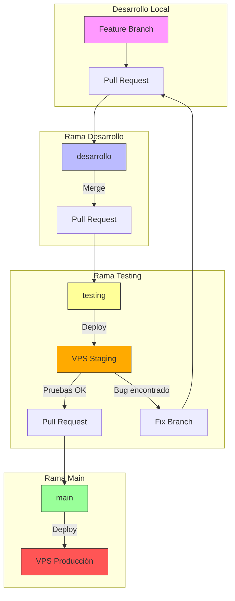
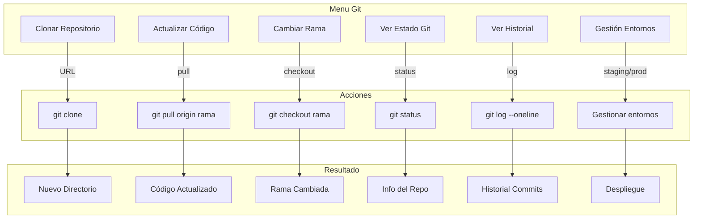

# Plan de Acción: Flujo de Trabajo Git para BBAlert

## Resumen

Este plan establece un flujo de trabajo Git estructurado que asegura que todos los cambios sean probados en un entorno de staging antes de ser desplegados en producción.

## Diagrama del Flujo de Trabajo



## Estructura de Ramas

| Rama | Propósito | Protección |
|------|-----------|------------|
| `main` | Código en producción | Requiere PR aprobado + 1 review |
| `testing` | Código en staging para pruebas | Requiere PR desde dev |
| `dev` | Integración de features | Requiere PR desde feature branch |
| `feature/*` | Desarrollo de nuevas funcionalidades | Sin protección |

## Estructura del VPS

```
/home/usuario/
├── bbalert-staging/     # Entorno de pruebas (rama testing)
│   ├── bbalert/
│   ├── venv/
│   └── logs/
├── bbalert-prod/        # Entorno de producción (rama main)
│   ├── bbalert/
│   ├── venv/
│   └── logs/
└── scripts/
    ├── deploy-staging.sh
    └── deploy-prod.sh
```

---

## Issues a Crear en GitHub

### Issue #1: Crear ramas base del flujo de trabajo

**Título:** `infra: crear ramas desarrollo y testing`

**Descripción:**
Crear las ramas necesarias para el flujo de trabajo Git.

**Checklist:**
- [ ] Crear rama `desarrollo` desde `main`
- [ ] Crear rama `testing` desde `desarrollo`
- [ ] Subir ramas al repositorio remoto
- [ ] Verificar que las ramas existen en GitHub

**Comandos:**
```bash
git checkout main
git pull origin main
git checkout -b desarrollo
git push origin desarrollo
git checkout -b testing
git push origin testing
```

---

### Issue #2: Configurar protección de ramas

**Título:** `infra: configurar branch protection rules`

**Descripción:**
Configurar las reglas de protección para las ramas principales.

**Checklist:**
- [ ] Proteger rama `main`:
  - Requerir Pull Request antes de merge
  - Requerir 1 aprobación
  - Requerir que la rama esté actualizada
  - No permitir force push
  - No permitir eliminación
- [ ] Proteger rama `testing`:
  - Requerir Pull Request antes de merge
  - No permitir force push
  - No permitir eliminación
- [ ] Proteger rama `desarrollo`:
  - Requerir Pull Request antes de merge
  - No permitir force push

**Configuración en GitHub:**
Settings → Branches → Add branch protection rule

---

### Issue #3: Crear estructura de directorios en VPS

**Título:** `infra: preparar entornos staging y producción en VPS`

**Descripción:**
Crear la estructura de directorios para los entornos de staging y producción.

**Checklist:**
- [ ] Crear directorio `/home/usuario/bbalert-staging`
- [ ] Crear directorio `/home/usuario/bbalert-prod`
- [ ] Clonar repositorio en cada directorio
- [ ] Crear entornos virtuales Python en cada uno
- [ ] Instalar dependencias en ambos entornos
- [ ] Configurar archivos `.env` para cada entorno

**Comandos:**
```bash
# En el VPS
mkdir -p ~/bbalert-staging ~/bbalert-prod

# Staging
cd ~/bbalert-staging
git clone https://github.com/ersus93/bbalert.git
python3 -m venv venv
source venv/bin/activate
pip install -r bbalert/requirements.txt

# Producción
cd ~/bbalert-prod
git clone https://github.com/ersus93/bbalert.git
python3 -m venv venv
source venv/bin/activate
pip install -r bbalert/requirements.txt
```

---

### Issue #4: Crear scripts de despliegue

**Título:** `infra: crear scripts de despliegue automatizado`

**Descripción:**
Crear scripts bash para facilitar el despliegue en cada entorno.

**Checklist:**
- [ ] Crear script `deploy-staging.sh`
- [ ] Crear script `deploy-prod.sh`
- [ ] Configurar permisos de ejecución
- [ ] Documentar uso de los scripts

**Script `deploy-staging.sh`:**
```bash
#!/bin/bash
set -e

echo "=== Desplegando a STAGING ==="
cd ~/bbalert-staging/bbalert
git fetch origin
git checkout testing
git pull origin testing
source ../venv/bin/activate
pip install -r requirements.txt --quiet
echo "Staging actualizado a: $(git log -1 --oneline)"
```

**Script `deploy-prod.sh`:**
```bash
#!/bin/bash
set -e

echo "=== Desplegando a PRODUCCIÓN ==="
cd ~/bbalert-prod/bbalert
git fetch origin
git checkout main
git pull origin main
source ../venv/bin/activate
pip install -r requirements.txt --quiet
echo "Producción actualizada a: $(git log -1 --oneline)"
```

---

### Issue #5: Configurar servicios systemd

**Título:** `infra: configurar servicios systemd para bbalert`

**Descripción:**
Crear servicios systemd para ejecutar el bot en ambos entornos.

**Checklist:**
- [ ] Crear servicio `bbalert-staging.service`
- [ ] Crear servicio `bbalert-prod.service`
- [ ] Habilitar servicios (sin iniciar aún)
- [ ] Documentar comandos de gestión

**Archivo `/etc/systemd/system/bbalert-staging.service`:**
```ini
[Unit]
Description=BBAlert Bot - Staging
After=network.target

[Service]
Type=simple
User=usuario
WorkingDirectory=/home/usuario/bbalert-staging/bbalert
ExecStart=/home/usuario/bbalert-staging/venv/bin/python bbalert.py
Restart=always
RestartSec=10

[Install]
WantedBy=multi-user.target
```

---

### Issue #6: Crear plantilla de Pull Request

**Título:** `docs: crear plantilla de Pull Request`

**Descripción:**
Crear una plantilla estandarizada para los Pull Requests.

**Checklist:**
- [ ] Crear directorio `.github`
- [ ] Crear archivo `PULL_REQUEST_TEMPLATE.md`

**Archivo `.github/PULL_REQUEST_TEMPLATE.md`:**
```markdown
## Descripción
Descripción breve de los cambios realizados.

## Tipo de cambio
- [ ] Bug fix
- [ ] Nueva funcionalidad
- [ ] Refactorización
- [ ] Documentación
- [ ] Infraestructura

## Checklist
- [ ] El código sigue las convenciones del proyecto
- [ ] Se han realizado pruebas locales
- [ ] La documentación ha sido actualizada si es necesario

## Issue relacionado
Closes #
```

---

### Issue #7: Documentar flujo de trabajo

**Título:** `docs: crear documentación del flujo de trabajo Git`

**Descripción:**
Crear documento que explique el flujo de trabajo para el equipo.

**Checklist:**
- [ ] Crear archivo `docs/WORKFLOW.md`
- [ ] Incluir diagrama del flujo
- [ ] Documentar comandos comunes
- [ ] Documentar proceso de pruebas

---

## Flujo de Trabajo Paso a Paso

### 1. Crear una nueva funcionalidad

```bash
# Crear rama feature desde desarrollo
git checkout desarrollo
git pull origin desarrollo
git checkout -b feature/nueva-funcionalidad

# Desarrollar y hacer commits
git add .
git commit -m "feat: agregar nueva funcionalidad"

# Subir rama
git push origin feature/nueva-funcionalidad
```

### 2. Merge a desarrollo

1. Crear Pull Request en GitHub: `feature/nueva-funcionalidad` → `desarrollo`
2. Esperar aprobación (si aplica)
3. Hacer merge del PR

### 3. Despliegue a testing

```bash
# Crear PR: desarrollo → testing
# Hacer merge del PR

# En el VPS
~/scripts/deploy-staging.sh
sudo systemctl restart bbalert-staging
```

### 4. Pruebas en staging

- Verificar que el bot funciona correctamente
- Probar las nuevas funcionalidades
- Verificar que no hay regresiones

### 5. Si hay bugs

```bash
# Crear rama fix desde desarrollo
git checkout desarrollo
git checkout -b fix/corregir-bug

# Corregir y hacer commit
git commit -m "fix: corregir bug encontrado en staging"

# Crear PR a desarrollo y repetir el proceso
```

### 6. Merge a main (producción)

```bash
# Crear PR: testing → main
# Hacer merge del PR

# En el VPS
~/scripts/deploy-prod.sh
sudo systemctl restart bbalert-prod
```

---

## Resumen de Comandos Frecuentes

| Acción | Comando |
|--------|---------|
| Crear feature | `git checkout -b feature/nombre desarrollo` |
| Actualizar rama | `git pull origin nombre-rama` |
| Subir cambios | `git push origin nombre-rama` |
| Ver estado | `git status` |
| Ver ramas | `git branch -a` |
| Cambiar rama | `git checkout nombre-rama` |

---

## Próximos Pasos

1. Crear los issues en GitHub en el orden indicado
2. Ejecutar los comandos para crear las ramas
3. Configurar las protecciones de ramas en GitHub
4. Preparar el VPS con la estructura de directorios
5. Crear los scripts de despliegue
6. Documentar todo el proceso

---

# Mejoras al Script bbalertv3.sh

## Análisis del Script Actual

El script [`bbalertv3.sh`](bbalertv3.sh) es un gestor completo de bots Telegram con las siguientes funcionalidades:

| Funcionalidad | Descripción |
|---------------|-------------|
| Detección de bots | Busca automáticamente directorios con `bbalert.py` y `requirements.txt` |
| Entorno virtual | Crea y gestiona venv con Python 3.12/3.13 |
| Dependencias | Instala y actualiza paquetes desde `requirements.txt` |
| Servicio systemd | Crea, inicia, detiene y reinicia el servicio |
| Variables de entorno | Configura el archivo `.env` |
| Logs | Visualización en tiempo real con journalctl |

## Nuevas Funcionalidades Git a Implementar

### Diagrama de las Nuevas Opciones



### Detalle de las Nuevas Funciones

#### 1. `git_clone_repository()` - Clonar Repositorio

**Propósito:** Permitir clonar el repositorio desde GitHub si no existe localmente.

**Funcionalidades:**
- Solicitar URL del repositorio (con valor por defecto: `https://github.com/ersus93/bbalert.git`)
- Solicitar directorio destino
- Clonar el repositorio
- Ofrecer configurar el bot después de clonar

**Pseudocódigo:**
```bash
git_clone_repository() {
    print_header "📥 CLONAR REPOSITORIO"
    
    # URL por defecto
    DEFAULT_REPO="https://github.com/ersus93/bbalert.git"
    read -p "URL del repositorio [$DEFAULT_REPO]: " REPO_URL
    REPO_URL=${REPO_URL:-$DEFAULT_REPO}
    
    # Directorio destino
    read -p "Directorio destino [~/bbalert]: " DEST_DIR
    DEST_DIR=${DEST_DIR:-"$HOME/bbalert"}
    DEST_DIR="${DEST_DIR/#\~/$HOME}"
    
    # Clonar
    print_step "Clonando $REPO_URL..."
    git clone "$REPO_URL" "$DEST_DIR"
    
    if [ $? -eq 0 ]; then
        print_success "Repositorio clonado en $DEST_DIR"
        # Ofrecer configurar
        read -p "¿Configurar este bot ahora? (S/n): " setup_now
        if [[ ! "$setup_now" =~ ^[nN]$ ]]; then
            PROJECT_DIR="$DEST_DIR"
            # Continuar con configuración
        fi
    fi
}
```

#### 2. `git_pull_repository()` - Actualizar Código

**Propósito:** Actualizar el código desde el repositorio remoto.

**Funcionalidades:**
- Mostrar rama actual
- Fetch de cambios remotos
- Mostrar commits disponibles para actualizar
- Confirmar antes de actualizar
- Opción de reiniciar el servicio después de actualizar

**Pseudocódigo:**
```bash
git_pull_repository() {
    print_header "📥 ACTUALIZAR CÓDIGO DEL REPOSITORIO"
    
    cd "$PROJECT_DIR" || return 1
    
    # Verificar que es un repo git
    if [ ! -d ".git" ]; then
        print_error "Este directorio no es un repositorio Git."
        return 1
    fi
    
    # Mostrar rama actual
    CURRENT_BRANCH=$(git branch --show-current)
    print_info "Rama actual: $CURRENT_BRANCH"
    
    # Fetch
    print_step "Buscando actualizaciones..."
    git fetch origin
    
    # Verificar si hay cambios
    LOCAL=$(git rev-parse HEAD)
    REMOTE=$(git rev-parse @{u} 2>/dev/null)
    
    if [ "$LOCAL" = "$REMOTE" ]; then
        print_success "El código está actualizado."
        return 0
    fi
    
    # Mostrar cambios disponibles
    print_info "Nuevos commits disponibles:"
    git log HEAD..@{u} --oneline
    
    echo ""
    read -p "¿Actualizar ahora? (S/n): " confirm
    if [[ "$confirm" =~ ^[nN]$ ]]; then
        return 0
    fi
    
    # Pull
    print_step "Actualizando código..."
    git pull origin "$CURRENT_BRANCH"
    
    if [ $? -eq 0 ]; then
        print_success "Código actualizado correctamente."
        
        # Preguntar sobre dependencias
        read -p "¿Actualizar dependencias? (S/n): " update_deps
        if [[ ! "$update_deps" =~ ^[nN]$ ]]; then
            install_dependencies
        fi
        
        # Preguntar sobre reinicio
        if systemctl is-active --quiet "$SERVICE_NAME" 2>/dev/null; then
            read -p "¿Reiniciar el bot? (S/n): " restart_bot
            if [[ ! "$restart_bot" =~ ^[nN]$ ]]; then
                manage_service "restart"
            fi
        fi
    fi
}
```

#### 3. `git_switch_branch()` - Cambiar de Rama

**Propósito:** Cambiar entre las ramas del flujo de trabajo (main, testing, desarrollo).

**Funcionalidades:**
- Listar ramas disponibles
- Mostrar rama actual
- Permitir seleccionar rama destino
- Verificar cambios no committeados
- Cambiar de rama
- Actualizar dependencias si es necesario

**Pseudocódigo:**
```bash
git_switch_branch() {
    print_header "🔄 CAMBIAR DE RAMA"
    
    cd "$PROJECT_DIR" || return 1
    
    # Verificar que es un repo git
    if [ ! -d ".git" ]; then
        print_error "Este directorio no es un repositorio Git."
        return 1
    fi
    
    # Mostrar rama actual
    CURRENT_BRANCH=$(git branch --show-current)
    print_info "Rama actual: ${CYAN}$CURRENT_BRANCH${NC}"
    
    # Verificar cambios pendientes
    if ! git diff-index --quiet HEAD --; then
        print_warning "Tienes cambios sin committear:"
        git status --short
        echo ""
        read -p "¿Descartar cambios y continuar? (s/N): " discard
        if [[ ! "$discard" =~ ^[sS]$ ]]; then
            print_info "Operación cancelada."
            return 0
        fi
        git checkout -- .
    fi
    
    # Listar ramas
    echo ""
    print_info "Ramas disponibles:"
    echo ""
    
    BRANCHES=("main" "testing" "desarrollo")
    local i=1
    for branch in "${BRANCHES[@]}"; do
        if [ "$branch" = "$CURRENT_BRANCH" ]; then
            echo -e "  ${GREEN}*) $branch ${YELLOW}(actual)${NC}"
        else
            echo -e "  ${GREEN}$i)${NC} $branch"
        fi
        ((i++))
    done
    echo -e "  ${YELLOW}0)${NC} Cancelar"
    echo ""
    
    read -p "Selecciona rama: " selection
    
    if [ "$selection" = "0" ]; then
        return 0
    fi
    
    # Determinar rama destino
    if [[ "$selection" =~ ^[0-9]+$ ]]; then
        TARGET_BRANCH="${BRANCHES[$((selection-1))]}"
    else
        TARGET_BRANCH="$selection"
    fi
    
    if [ -z "$TARGET_BRANCH" ]; then
        print_error "Selección inválida."
        return 1
    fi
    
    # Cambiar de rama
    print_step "Cambiando a rama $TARGET_BRANCH..."
    git checkout "$TARGET_BRANCH"
    git pull origin "$TARGET_BRANCH"
    
    if [ $? -eq 0 ]; then
        print_success "Ahora en rama: $TARGET_BRANCH"
        
        # Actualizar dependencias
        read -p "¿Actualizar dependencias? (S/n): " update_deps
        if [[ ! "$update_deps" =~ ^[nN]$ ]]; then
            install_dependencies
        fi
    fi
}
```

#### 4. `git_show_status()` - Ver Estado del Repositorio

**Propósito:** Mostrar información detallada del estado del repositorio.

**Funcionalidades:**
- Rama actual
- Último commit
- Archivos modificados
- Commits por push/pull

**Pseudocódigo:**
```bash
git_show_status() {
    print_header "📊 ESTADO DEL REPOSITORIO"
    
    cd "$PROJECT_DIR" || return 1
    
    if [ ! -d ".git" ]; then
        print_error "No es un repositorio Git."
        return 1
    fi
    
    echo ""
    # Rama actual
    CURRENT_BRANCH=$(git branch --show-current)
    echo -e "${CYAN}Rama actual:${NC}     $CURRENT_BRANCH"
    
    # Remote
    REMOTE_URL=$(git remote get-url origin 2>/dev/null)
    echo -e "${CYAN}Remote:${NC}          $REMOTE_URL"
    
    # Último commit
    LAST_COMMIT=$(git log -1 --format="%h - %s (%cr)")
    echo -e "${CYAN}Último commit:${NC}   $LAST_COMMIT"
    
    echo ""
    echo -e "${YELLOW}Estado de archivos:${NC}"
    git status --short
    
    echo ""
    echo -e "${YELLOW}Commits locales no enviados:${NC}"
    git log @{u}..HEAD --oneline 2>/dev/null || echo "  (ninguno)"
    
    echo ""
    echo -e "${YELLOW}Commits remotos no descargados:${NC}"
    git log HEAD..@{u} --oneline 2>/dev/null || echo "  (ninguno)"
    
    echo ""
    read -p "Presiona Enter para continuar..."
}
```

#### 5. `git_show_history()` - Ver Historial de Commits

**Propósito:** Mostrar el historial de commits del repositorio.

**Funcionalidades:**
- Mostrar últimos N commits
- Filtrar por rama
- Ver detalles de un commit específico

**Pseudocódigo:**
```bash
git_show_history() {
    print_header "📜 HISTORIAL DE COMMITS"
    
    cd "$PROJECT_DIR" || return 1
    
    if [ ! -d ".git" ]; then
        print_error "No es un repositorio Git."
        return 1
    fi
    
    echo ""
    print_info "Últimos 15 commits:"
    echo ""
    git log --oneline -15 --decorate --graph
    
    echo ""
    read -p "¿Ver detalles de un commit? (ingresa hash o Enter para continuar): " commit_hash
    
    if [ -n "$commit_hash" ]; then
        echo ""
        git show "$commit_hash"
        read -p "Presiona Enter para continuar..."
    fi
}
```

#### 6. `manage_environments()` - Gestión de Entornos Staging/Producción

**Propósito:** Gestionar múltiples instancias del bot para staging y producción.

**Funcionalidades:**
- Listar entornos configurados
- Cambiar entre entornos
- Desplegar a staging/producción
- Ver estado de ambos entornos

**Pseudocódigo:**
```bash
manage_environments() {
    print_header "🌐 GESTIÓN DE ENTORNOS"
    
    echo ""
    print_info "Entornos disponibles:"
    echo ""
    echo -e "  ${GREEN}1)${NC} Staging    ${YELLOW}(rama: testing)${NC}"
    echo -e "  ${GREEN}2)${NC} Producción ${YELLOW}(rama: main)${NC}"
    echo -e "  ${YELLOW}0)${NC} Volver"
    echo ""
    
    read -p "Selecciona entorno: " env_choice
    
    case $env_choice in
        1)
            ENV_NAME="staging"
            ENV_DIR="$HOME/bbalert-staging"
            ENV_BRANCH="testing"
            ;;
        2)
            ENV_NAME="producción"
            ENV_DIR="$HOME/bbalert-prod"
            ENV_BRANCH="main"
            ;;
        *)
            return 0
            ;;
    esac
    
    print_header "🔧 ENTORNO: $ENV_NAME"
    
    # Verificar si existe
    if [ ! -d "$ENV_DIR" ]; then
        print_warning "El entorno no existe."
        read -p "¿Crear entorno $ENV_NAME? (S/n): " create_env
        
        if [[ ! "$create_env" =~ ^[nN]$ ]]; then
            create_environment "$ENV_DIR" "$ENV_BRANCH"
        fi
        return 0
    fi
    
    # Mostrar estado
    ENV_SERVICE=$(basename "$ENV_DIR")
    echo ""
    print_info "Directorio: $ENV_DIR"
    print_info "Rama: $ENV_BRANCH"
    
    if systemctl is-active --quiet "$ENV_SERVICE" 2>/dev/null; then
        echo -e "${GREEN}Estado: En ejecución${NC}"
    else
        echo -e "${RED}Estado: Detenido${NC}"
    fi
    
    echo ""
    echo -e "${YELLOW}Acciones:${NC}"
    echo "  1) Actualizar código (git pull)"
    echo "  2) Iniciar servicio"
    echo "  3) Detener servicio"
    echo "  4) Reiniciar servicio"
    echo "  5) Ver logs"
    echo "  0) Volver"
    echo ""
    
    read -p "Acción: " action
    
    case $action in
        1) 
            cd "$ENV_DIR"
            git checkout "$ENV_BRANCH"
            git pull origin "$ENV_BRANCH"
            print_success "Código actualizado."
            ;;
        2) sudo systemctl start "$ENV_SERVICE" ;;
        3) sudo systemctl stop "$ENV_SERVICE" ;;
        4) sudo systemctl restart "$ENV_SERVICE" ;;
        5) sudo journalctl -u "$ENV_SERVICE" -f ;;
    esac
}

create_environment() {
    local ENV_DIR=$1
    local ENV_BRANCH=$2
    
    print_step "Creando entorno en $ENV_DIR..."
    
    # Clonar
    git clone https://github.com/ersus93/bbalert.git "$ENV_DIR"
    cd "$ENV_DIR"
    git checkout "$ENV_BRANCH"
    
    # Crear venv
    create_venv
    
    # Instalar dependencias
    install_dependencies
    
    # Crear servicio
    create_systemd_service
    
    print_success "Entorno creado exitosamente."
}
```

### Menú Actualizado

El menú principal se reorganizará para incluir las nuevas opciones:

```
╔════════════════════════════════════════════╗
║   🤖 GESTOR MULTI-BOT TELEGRAM (v3)        ║
╚════════════════════════════════════════════╝

Bot Actual:    bbalert
Servicio:      bbalert
Directorio:    /home/user/bbalert
Rama Git:      main

● Estado: Bot en ejecución

━━━━━━━━━━━━━━━━━━━━━━━━━━━━━━━━━━━━━━━━━━━━
📦 INSTALACIÓN Y CONFIGURACIÓN
  1)  🚀 Instalación Completa (desde cero)
  2)  🔧 Crear/Recrear Entorno Virtual (venv)
  3)  📥 Instalar/Actualizar Dependencias
  4)  🔑 Configurar Variables de Entorno (.env)
  5)  ⚙️  Crear/Actualizar Servicio Systemd

🎮 CONTROL DEL BOT
  6)  ▶️  Iniciar Bot
  7)  ⏹️  Detener Bot
  8)  🔄 Reiniciar Bot
  9)  📊 Ver Estado del Servicio
  10) 📜 Ver Logs en Tiempo Real

🔀 CONTROL DE GIT
  11) 📥 Clonar Repositorio
  12) 🔄 Actualizar Código (git pull)
  13) 🌿 Cambiar de Rama
  14) 📊 Ver Estado del Repositorio
  15) 📜 Ver Historial de Commits

🌐 ENTORNOS
  16) 🗺️  Gestión de Entornos (Staging/Producción)

🔧 MANTENIMIENTO
  17) 🗑️  Eliminar Dependencia
  18) 🗑️  Desinstalar Servicio

📂 OTROS
  19) 📂 Cambiar Bot/Directorio Objetivo
  0)  ❌ Salir

━━━━━━━━━━━━━━━━━━━━━━━━━━━━━━━━━━━━━━━━━━━━
```

---

## Issue Adicional: Mejorar Script bbalertv3.sh

### Issue #8: Agregar funcionalidades Git al script de gestión

**Título:** `feat: agregar gestión de Git y entornos al script bbalertv3.sh`

**Descripción:**
Extender el script de gestión para incluir funcionalidades de control de versiones Git y gestión de entornos staging/producción.

**Checklist:**
- [ ] Agregar función `git_clone_repository()`
- [ ] Agregar función `git_pull_repository()`
- [ ] Agregar función `git_switch_branch()`
- [ ] Agregar función `git_show_status()`
- [ ] Agregar función `git_show_history()`
- [ ] Agregar función `manage_environments()`
- [ ] Agregar función `create_environment()`
- [ ] Actualizar menú principal con nuevas opciones
- [ ] Mostrar rama Git actual en el header del menú
- [ ] Probar todas las funcionalidades

**Archivos afectados:**
- `bbalertv3.sh`

**Estimación:** Media

---

# Pasos de Implementación

## Paso 1: Crear Rama de Desarrollo

```bash
# Crear y cambiar a la rama dev
git checkout -b dev

# Subir la rama al remoto
git push -u origin dev
```

## Paso 2: Crear Issues en GitHub

Usar GitHub CLI (`gh`) para crear cada issue:

### Issue #1: Crear ramas base
```bash
gh issue create \
  --title "infra: crear ramas desarrollo y testing" \
  --body "## Descripción
Crear las ramas necesarias para el flujo de trabajo Git.

## Checklist
- [ ] Crear rama \`desarrollo\` desde \`main\`
- [ ] Crear rama \`testing\` desde \`desarrollo\`
- [ ] Subir ramas al repositorio remoto
- [ ] Verificar que las ramas existen en GitHub

## Comandos
\`\`\`bash
git checkout main
git pull origin main
git checkout -b desarrollo
git push origin desarrollo
git checkout -b testing
git push origin testing
\`\`\`" \
  --assignee "@me" \
  --label "infrastructure"
```

### Issue #2: Configurar protección de ramas
```bash
gh issue create \
  --title "infra: configurar branch protection rules" \
  --body "## Descripción
Configurar las reglas de protección para las ramas principales.

## Checklist
### Rama main
- [ ] Requerir Pull Request antes de merge
- [ ] Requerir 1 aprobación
- [ ] Requerir que la rama esté actualizada
- [ ] No permitir force push
- [ ] No permitir eliminación

### Rama testing
- [ ] Requerir Pull Request antes de merge
- [ ] No permitir force push
- [ ] No permitir eliminación

### Rama desarrollo
- [ ] Requerir Pull Request antes de merge
- [ ] No permitir force push

## Configuración
Settings → Branches → Add branch protection rule" \
  --assignee "@me" \
  --label "infrastructure"
```

### Issue #3: Crear estructura en VPS
```bash
gh issue create \
  --title "infra: preparar entornos staging y producción en VPS" \
  --body "## Descripción
Crear la estructura de directorios para los entornos de staging y producción.

## Checklist
- [ ] Crear directorio \`/home/usuario/bbalert-staging\`
- [ ] Crear directorio \`/home/usuario/bbalert-prod\`
- [ ] Clonar repositorio en cada directorio
- [ ] Crear entornos virtuales Python en cada uno
- [ ] Instalar dependencias en ambos entornos
- [ ] Configurar archivos \`.env\` para cada entorno

## Comandos
\`\`\`bash
# En el VPS
mkdir -p ~/bbalert-staging ~/bbalert-prod

# Staging
cd ~/bbalert-staging
git clone https://github.com/ersus93/bbalert.git
python3 -m venv venv
source venv/bin/activate
pip install -r bbalert/requirements.txt

# Producción
cd ~/bbalert-prod
git clone https://github.com/ersus93/bbalert.git
python3 -m venv venv
source venv/bin/activate
pip install -r bbalert/requirements.txt
\`\`\`" \
  --assignee "@me" \
  --label "infrastructure"
```

### Issue #4: Crear scripts de despliegue
```bash
gh issue create \
  --title "infra: crear scripts de despliegue automatizado" \
  --body "## Descripción
Crear scripts bash para facilitar el despliegue en cada entorno.

## Checklist
- [ ] Crear script \`deploy-staging.sh\`
- [ ] Crear script \`deploy-prod.sh\`
- [ ] Configurar permisos de ejecución
- [ ] Documentar uso de los scripts

## Script deploy-staging.sh
\`\`\`bash
#!/bin/bash
set -e
echo '=== Desplegando a STAGING ==='
cd ~/bbalert-staging/bbalert
git fetch origin
git checkout testing
git pull origin testing
source ../venv/bin/activate
pip install -r requirements.txt --quiet
echo 'Staging actualizado a:' \$(git log -1 --oneline)
\`\`\`

## Script deploy-prod.sh
\`\`\`bash
#!/bin/bash
set -e
echo '=== Desplegando a PRODUCCIÓN ==='
cd ~/bbalert-prod/bbalert
git fetch origin
git checkout main
git pull origin main
source ../venv/bin/activate
pip install -r requirements.txt --quiet
echo 'Producción actualizada a:' \$(git log -1 --oneline)
\`\`\`" \
  --assignee "@me" \
  --label "infrastructure"
```

### Issue #5: Configurar servicios systemd
```bash
gh issue create \
  --title "infra: configurar servicios systemd para bbalert" \
  --body "## Descripción
Crear servicios systemd para ejecutar el bot en ambos entornos.

## Checklist
- [ ] Crear servicio \`bbalert-staging.service\`
- [ ] Crear servicio \`bbalert-prod.service\`
- [ ] Habilitar servicios (sin iniciar aún)
- [ ] Documentar comandos de gestión

## Archivo /etc/systemd/system/bbalert-staging.service
\`\`\`ini
[Unit]
Description=BBAlert Bot - Staging
After=network.target

[Service]
Type=simple
User=usuario
WorkingDirectory=/home/usuario/bbalert-staging/bbalert
ExecStart=/home/usuario/bbalert-staging/venv/bin/python bbalert.py
Restart=always
RestartSec=10

[Install]
WantedBy=multi-user.target
\`\`\`" \
  --assignee "@me" \
  --label "infrastructure"
```

### Issue #6: Crear plantilla de PR
```bash
gh issue create \
  --title "docs: crear plantilla de Pull Request" \
  --body "## Descripción
Crear una plantilla estandarizada para los Pull Requests.

## Checklist
- [ ] Crear directorio \`.github\`
- [ ] Crear archivo \`PULL_REQUEST_TEMPLATE.md\`

## Archivo .github/PULL_REQUEST_TEMPLATE.md
\`\`\`markdown
## Descripción
Descripción breve de los cambios realizados.

## Tipo de cambio
- [ ] Bug fix
- [ ] Nueva funcionalidad
- [ ] Refactorización
- [ ] Documentación
- [ ] Infraestructura

## Checklist
- [ ] El código sigue las convenciones del proyecto
- [ ] Se han realizado pruebas locales
- [ ] La documentación ha sido actualizada si es necesario

## Issue relacionado
Closes #
\`\`\`" \
  --assignee "@me" \
  --label "documentation"
```

### Issue #7: Documentar flujo de trabajo
```bash
gh issue create \
  --title "docs: crear documentación del flujo de trabajo Git" \
  --body "## Descripción
Crear documento que explique el flujo de trabajo para el equipo.

## Checklist
- [ ] Crear archivo \`docs/WORKFLOW.md\`
- [ ] Incluir diagrama del flujo
- [ ] Documentar comandos comunes
- [ ] Documentar proceso de pruebas

## Contenido sugerido
- Diagrama del flujo de ramas
- Comandos Git frecuentes
- Proceso de creación de features
- Proceso de merge y despliegue
- Manejo de conflictos" \
  --assignee "@me" \
  --label "documentation"
```

### Issue #8: Mejorar script bbalertv3.sh
```bash
gh issue create \
  --title "feat: agregar gestión de Git y entornos al script bbalertv3.sh" \
  --body "## Descripción
Extender el script de gestión para incluir funcionalidades de control de versiones Git y gestión de entornos staging/producción.

## Checklist
- [ ] Agregar función \`git_clone_repository()\`
- [ ] Agregar función \`git_pull_repository()\`
- [ ] Agregar función \`git_switch_branch()\`
- [ ] Agregar función \`git_show_status()\`
- [ ] Agregar función \`git_show_history()\`
- [ ] Agregar función \`manage_environments()\`
- [ ] Agregar función \`create_environment()\`
- [ ] Actualizar menú principal con nuevas opciones
- [ ] Mostrar rama Git actual en el header del menú
- [ ] Probar todas las funcionalidades

## Archivos afectados
- \`bbalertv3.sh\`

## Nueva sección del menú
\`\`\`
🔀 CONTROL DE GIT
  11) 📥 Clonar Repositorio
  12) 🔄 Actualizar Código (git pull)
  13) 🌿 Cambiar de Rama
  14) 📊 Ver Estado del Repositorio
  15) 📜 Ver Historial de Commits

🌐 ENTORNOS
  16) 🗺️  Gestión de Entornos (Staging/Producción)
\`\`\`" \
  --assignee "@me" \
  --label "enhancement"
```

## Orden de Ejecución Recomendado

1. **Issue #1** → Crear ramas base (prerrequisito para todo)
2. **Issue #6** → Crear plantilla de PR (rápido, sin dependencias)
3. **Issue #7** → Documentar flujo de trabajo (mientras se configura el resto)
4. **Issue #2** → Configurar protección de ramas (después de crear las ramas)
5. **Issue #3** → Preparar VPS (puede hacerse en paralelo)
6. **Issue #4** → Crear scripts de despliegue (después de VPS listo)
7. **Issue #5** → Configurar systemd (después de scripts)
8. **Issue #8** → Mejorar script bbalertv3.sh (puede hacerse en paralelo)
