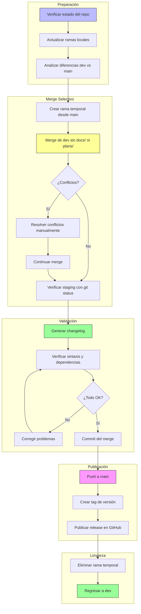

#   
# Plan: Merge Selectivo de dev a main (sin docs/, plans/, ski/ ni utiles/)

## Resumen

Este plan describe el proceso para pasar el código de la rama `dev` a `main`, excluyendo los directorios `docs/`, `plans/`, `ski/` y `utiles/` (que contiene archivos de Access y análisis), publicar los cambios y verificar que no existan inconsistencias.
  
**Objetivo**: Dejar en `main` solo los directorios, documentos y código necesarios para que el bot funcione. Los usuarios que clonen el repositorio público solo necesitan el código funcional, no el proceso de desarrollo.  
  
> ⚠️ **Antes de empezar**: Asegúrate de que tu working tree esté limpio (`git status`). Si tienes cambios sin commitear en `dev`, guárdalos con `git stash` antes de continuar.  
  
-----  
  
## Directorios Excluidos de main  
  
|Elemento          |Propósito                      |¿Por qué excluirlo de main?                             |
|------------------|-------------------------------|--------------------------------------------------------|
|`docs/`           |Documentación de desarrollo    |Documentación interna del proceso de desarrollo         |
|`plans/`          |Planes y especificaciones      |Planes de desarrollo, no necesarios para ejecutar el bot|
|`ski/`            |Development skills             |Internal documentation and development skill files       |
|`utiles/`         |Access database files          |Archivos de Access, análisis y datos sensibles que no deben publicarse|
  
## Estructura Final de main (Lo que debe quedar)  
  
```  
main/  
├── .gitignore  
├── ads.json  
├── apit.env.example  
├── babel.cfg  
├── bbalert.py  
├── LICENSE  
├── mbot.sh  
├── README.md  
├── requirements.txt  
├── tree.md  
├── update_version.py  
├── version.txt  
├── .github/  
├── core/  
├── data-example/  
├── handlers/  
├── locales/  
├── scripts/  
├── systemd/  
├── tests/  
└── utils/  
```  
  
-----  
  
## Diagrama del Flujo de Trabajo  
  

  
-----  
  
## Paso 1: Verificar Estado del Repositorio  
  
```bash  
# Confirmar que estás en dev y el working tree está limpio  
git branch --show-current  
git status  
  
# Si hay cambios sin commitear, guardarlos temporalmente  
# git stash  
  
# Actualizar referencias remotas  
git fetch --all  
  
# Ver commits de dev que aún no están en main  
git log main..dev --oneline  
  
# Ver archivos afectados entre ramas  
git diff --name-status main..dev  
```  
  
### Verificación esperada  
  
- La rama `dev` debe existir local y en el remoto  
- Debe haber commits en `dev` que no están en `main`  
- Los directorios `docs/` y `plans/` pueden aparecer en las diferencias (serán excluidos)  
  
-----  
  
## Paso 2: Merge Selectivo (Estrategia Recomendada)  
  
Usamos `--no-commit --no-ff` para tener control total antes de commitear.  
  
```bash  
# 1. Situarse en main actualizado  
git checkout main  
git pull origin main  
  
# 2. Crear rama temporal de trabajo  
git checkout -b merge-dev-to-main  
  
# 3. Traer cambios de dev SIN hacer commit automático  
git merge dev --no-commit --no-ff  
  
# 4. Sacar docs/, plans/, ski/ y utiles/ del staging
git reset HEAD docs/ 2>/dev/null || true
git reset HEAD plans/ 2>/dev/null || true
git reset HEAD ski/ 2>/dev/null || true
git reset HEAD utiles/ 2>/dev/null || true

# 5. Restaurar esos directorios al estado de main (no al de dev)
git checkout -- docs/ 2>/dev/null || true
git checkout -- plans/ 2>/dev/null || true
git checkout -- ski/ 2>/dev/null || true
git checkout -- utiles/ 2>/dev/null || true
  
# 6. Revisar que el staging es correcto ANTES de commitear  
git status  
git diff --cached --name-only   # solo archivos que van al commit  
  
# 7. Commit del merge  
git commit -m "merge: dev a main (sin docs/, plans/, ski/ ni utiles/)"  
```  
  
> 💡 **Si en el paso 3 aparecen conflictos**, Git lo indicará. Resuélvelos manualmente (edita los archivos marcados con `<<<<<<<`), luego haz `git add <archivo>` por cada uno y continúa desde el paso 4.  
  
### Estrategias Alternativas  
  
<details>  
<summary>Opción B: Cherry-pick de commits específicos</summary>  
  
Útil cuando solo quieres incluir commits puntuales:  
  
```bash  
# Ver commits de dev que no están en main  
git log main..dev --oneline  
  
# Crear rama temporal y aplicar commits uno a uno  
git checkout main  
git checkout -b merge-dev-to-main  
git cherry-pick <hash1>  
git cherry-pick <hash2>  
# ...  
```  
  
</details>  
  
<details>  
<summary>Opción C: Merge con estrategia ours</summary>  
  
Útil si docs/ y plans/ no existen en main y quieres asegurarte de que no aparezcan:  
  
```bash  
git checkout main  
git checkout -b merge-dev-to-main  
git merge dev -X ours --no-commit
git checkout dev -- . ':!docs/' ':!plans/' ':!ski/' ':!utiles/'
git commit -m "merge: dev a main (sin docs/, plans/, ski/ ni utiles/)"
```  
  
</details>  
  
-----  
  
## Paso 3: Generar Changelog  
  
```bash  
# Ver commits que formarán parte del changelog  
git log main..dev --oneline --no-merges  
```  
  
### Categorías  
  
|Categoría               |Prefijo de Commit      |  
|------------------------|-----------------------|  
|✨ Nuevas funcionalidades|`feat:`                |  
|🔧 Mejoras / Refactors   |`improve:`, `refactor:`|  
|🐛 Correcciones          |`fix:`                 |  
|📚 Documentación         |`docs:`                |  
|🔒 Seguridad             |`security:`            |  
|🚀 Deploy / Infra        |`deploy:`, `infra:`    |  
  
  
> Actualiza `CHANGELOG.md` (o el archivo equivalente) con estas categorías antes del push.  
  
-----  
  
## Paso 4: Verificar Inconsistencias  
  
### Checklist  
  
- [ ] Sintaxis Python sin errores  
- [ ] Todos los imports son válidos  
- [ ] `requirements.txt` está actualizado  
- [ ] Archivos de configuración correctos  
- [ ] Tests pasan correctamente  
- [ ] `.env.example` refleja las variables actuales  
- [ ] `docs/`, `plans/`, `ski/` y `utiles/` **NO** están en el staging  
  
### Comandos de Verificación  
  
```bash  
# Sintaxis Python  
python -m py_compile bbalert.py  
python -m py_compile core/*.py  
python -m py_compile handlers/*.py  
python -m py_compile utils/*.py  
  
# Linting (instalar si no está disponible)  
pip install pyflakes  
pyflakes bbalert.py core/ handlers/ utils/  
  
# Dependencias  
pip install -r requirements.txt --dry-run  
  
# Ejecutar tests  
python -m pytest tests/ -v   # o el comando que use el proyecto  
  
# Confirmar que docs/, plans/, ski/ y utiles/ NO están en el staging
git diff --cached --name-only | grep -E '^(docs|plans|ski|utiles)/' \
  && echo "⚠️ ATENCIÓN: docs/, plans/, ski/ o utiles/ están en el staging" \
  || echo "✅ docs/, plans/, ski/ y utiles/ excluidos correctamente"
```  
  
-----  
  
## Paso 5: Publicar en main  
  
```bash  
# 1. Fusionar la rama temporal en main  
git checkout main  
git merge merge-dev-to-main --ff-only  
  
# 2. Push a main  
git push origin main  
  
# 3. Crear tag de versión  
VERSION=$(cat version.txt)  
git tag -a "v$VERSION" -m "Release v$VERSION"  
git push origin "v$VERSION"  
  
# 4. Publicar release en GitHub (si usas gh CLI)  
gh release create "v$VERSION" --title "v$VERSION" --notes-file CHANGELOG.md  
```  
  
> 💡 Usa `--ff-only` en el merge final para garantizar un historial limpio y detectar posibles divergencias antes de publicar.  
  
-----  
  
## Paso 6: Verificación Post-Publicación  
  
```bash  
# Confirmar que main tiene los commits esperados  
git log origin/main -5 --oneline  
  
# Verificar que docs/ NO está en main
git ls-tree -d origin/main --name-only | grep -E '^docs$' \
  && echo "⚠️ docs/ encontrado en main" \
  || echo "✅ docs/ no está en main"

# Verificar que plans/ NO está en main
git ls-tree -d origin/main --name-only | grep -E '^plans$' \
  && echo "⚠️ plans/ encontrado en main" \
  || echo "✅ plans/ no está en main"

# Verificar que ski/ NO está en main
git ls-tree -d origin/main --name-only | grep -E '^ski$' \
  && echo "⚠️ ski/ encontrado en main" \
  || echo "✅ ski/ no está en main"

# Verificar que utiles/ NO está en main
git ls-tree -d origin/main --name-only | grep -E '^utiles$' \
  && echo "⚠️ utiles/ encontrado en main" \
  || echo "✅ utiles/ no está en main"

# Comparar main vs dev ignorando los directorios excluidos
git diff origin/main origin/dev --stat ':!docs' ':!plans' ':!ski' ':!utiles'
```  
  
-----  
  
## Paso 7: Limpieza y Retorno a dev  
  
```bash  
# Eliminar rama temporal local  
git branch -d merge-dev-to-main  
  
# Eliminar rama temporal remota (si fue pusheada por error)  
git push origin --delete merge-dev-to-main 2>/dev/null || true  
  
# Regresar a dev para continuar el desarrollo  
git checkout dev  
  
# Si habías guardado cambios con stash, recuperarlos  
# git stash pop  
```  
  
> **Regla de oro**: Nunca trabajes directamente en `main`. Vuelve a `dev` inmediatamente tras el merge.  
  
-----  
  
## Secuencia Completa (Copia Rápida)  
  
```bash  
# === PREPARACIÓN ===  
git fetch --all  
git checkout main  
git pull origin main  
  
# === MERGE SELECTIVO ===  
git checkout -b merge-dev-to-main
git merge dev --no-commit --no-ff
git reset HEAD docs/ 2>/dev/null || true
git reset HEAD plans/ 2>/dev/null || true
git reset HEAD ski/ 2>/dev/null || true
git reset HEAD utiles/ 2>/dev/null || true
git checkout -- docs/ 2>/dev/null || true
git checkout -- plans/ 2>/dev/null || true
git checkout -- ski/ 2>/dev/null || true
git checkout -- utiles/ 2>/dev/null || true
  
# Verificar staging antes de commitear  
git diff --cached --name-only  
  
git commit -m "merge: dev a main (sin docs/, plans/, ski/ ni utiles/)"  
  
# === VERIFICACIÓN ===  
python -m py_compile bbalert.py core/*.py handlers/*.py utils/*.py  
python -m pytest tests/ -v  
  
# === PUBLICACIÓN ===  
git checkout main  
git merge merge-dev-to-main --ff-only  
git push origin main  
  
VERSION=$(cat version.txt)  
git tag -a "v$VERSION" -m "Release v$VERSION"  
git push origin "v$VERSION"  
  
# === LIMPIEZA ===  
git branch -d merge-dev-to-main  
  
# === RETORNO A DEV ===  
git checkout dev  
```  
  
-----  
  
## Rollback  
  
Si algo sale mal después del push:  
  
```bash  
# Opción A: Revertir el último merge (crea un commit de reversión)  
git checkout main  
git revert -m 1 HEAD  
git push origin main  
  
# Opción B: Resetear al commit anterior (más agresivo, requiere --force)  
# git reset --hard HEAD~1  
# git push --force-with-lease origin main  
```  
  
> Prefiere **Opción A** si hay otros colaboradores. La Opción B reescribe el historial y puede causar problemas a quien ya haya hecho pull.  
  
-----  
  
## Mantenimiento Continuo  
  
### Qué va en main vs dev  
  
|✅ Incluir en main                          |❌ Excluir de main                              |  
|-------------------------------------------|-----------------------------------------------|  
|Código fuente (`*.py`)                     |Documentación de desarrollo (`docs/`)          |  
|Archivos de configuración                  |Planes y especificaciones (`plans/`)           |  
|Datos de ejemplo (`data-example/`)         |Development skills (`ski/`)                    |  
|                                           |Borradores, WIP y archivos Access (`utiles/`)  |  
|`README.md` (guía de usuario)              |Notas internas de desarrollo                   |  
|`LICENSE`, `requirements.txt`              |                                               |  
|Scripts de deploy y systemd                |                                               |  
|Tests (`tests/`) — son código de producción|                                               |  
  
### Flujo de Trabajo Recomendado  
  
1. **Desarrollo**: Trabajar siempre en `dev` o ramas `feature/`  
1. **Documentación interna**: Crear planes, docs, skills, datos y archivos de análisis Access en `docs/`, `plans/`, `ski/` y `utiles/` (rama `dev`)  
1. **Merge a main**: Usar este plan con merge selectivo  
1. **Release**: Crear tags y releases desde `main`  
1. **Nunca**: Commitear directamente en `main`  
